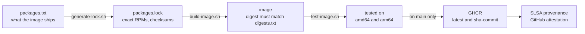

# ubi9-images

[](https://github.com/NWarila/ubi9-images/actions/workflows/build-images.yaml)

Container images built on Red Hat Universal Base Image 9: a base, language runtimes, and the toolsets
that build software for them. Every image is built reproducibly from a locked set of Red Hat packages,
tested on amd64 and arm64, and published with signed build provenance.

- **Reproducible.** Each image is built from a lock of exact RPM files. The same lock, Dockerfile,
  copied-in files and pinned BuildKit give the same image digest, and the build stops if the digest is
  not the one recorded.
- **Verifiable.** Every published image carries SLSA v1 build provenance, signed by the reusable
  workflow that built it, as GitHub's guidance for SLSA Build Level 3 describes. One command checks that
  an image was built by this repository's workflow, from this repository's source.
- **Nothing extra.** Images start from an empty root, hold their locked packages and a few
  configuration files, and run as user 65532. Runtime images have no shell, no package manager and no
  language package tool.
- **FIPS crypto policy.** The system crypto policy is `FIPS`, as the DISA RHEL 9 STIG requires, and the
  system OpenSSL loads the FIPS provider at the module version FIPS 140-3 certificate #4857 validates.
- **Tested before publishing.** Each image has its own tests, and nothing is published unless every
  image builds and passes them on both architectures.

## How it works



1. **Lock.** `build/generate-lock.sh` resolves an image's package list against Red Hat's repositories and
   writes the exact RPM files, with their addresses and checksums, into a lock for each architecture.
   It also checks that the locked files install together.
2. **Build.** `build/build-image.sh` builds the image's Dockerfile, which downloads exactly those files,
   refuses any that do not match their checksum or are not signed by Red Hat, and installs them into an
   empty root. A fixed date stands in for the clock, so the digest depends only on the inputs.
3. **Test.** `build/test-image.sh` runs the checks every image must pass, then the image's own tests in
   `images/<image>/test/`: the runtime starts, OpenSSL refuses what FIPS forbids, TLS verifies with the
   image's own CA bundle, and a toolset's sample application builds and runs on its runtime image.
4. **Publish.** A pull request that changes `build/`, `images/` or the two build workflows runs steps 2
   and 3. After it is merged, the run on `main` repeats them on the merge commit and then publishes each
   image whose digest changed: it tags the image `latest` and `sha-<commit>` and attests its
   provenance. The build job has no permission to write the repository or packages and cannot sign;
   the publish job runs no build.

## Images

| Image | What it is |
| --- | --- |
| `ghcr.io/nwarila/ubi9-micro` | The base: the C library, CA certificates, time zones and the OpenSSL FIPS provider. No shell, no package manager. Go programs run on it. |
| `ghcr.io/nwarila/ubi9-openjdk-17-runtime` | The headless OpenJDK 17 runtime. |
| `ghcr.io/nwarila/ubi9-openjdk-21-runtime` | The headless OpenJDK 21 runtime. |
| `ghcr.io/nwarila/ubi9-openjdk-25-runtime` | The headless OpenJDK 25 runtime. |
| `ghcr.io/nwarila/ubi9-python-312-runtime` | Python 3.12 and its standard library, apart from the Tk GUI modules (tkinter, IDLE, turtle). No pip. |
| `ghcr.io/nwarila/ubi9-nodejs-24-runtime` | The Node.js 24 runtime, with English locale data only. No npm. |
| `ghcr.io/nwarila/ubi9-dotnet-10-runtime` | The .NET 10 runtime and the ASP.NET Core shared framework. |
| `ghcr.io/nwarila/ubi9-dotnet-runtime-deps` | The native libraries that self-contained .NET applications need. No .NET runtime. |
| `ghcr.io/nwarila/ubi9-openjdk-17-toolset` | The OpenJDK 17 development kit, a shell and a package manager. |
| `ghcr.io/nwarila/ubi9-openjdk-21-toolset` | The OpenJDK 21 development kit, a shell and a package manager. |
| `ghcr.io/nwarila/ubi9-openjdk-25-toolset` | The OpenJDK 25 development kit, a shell and a package manager. |
| `ghcr.io/nwarila/ubi9-python-312-toolset` | pip, the Python headers, a C compiler, a shell and a package manager. |
| `ghcr.io/nwarila/ubi9-nodejs-24-toolset` | Node.js, npm, a C++ compiler, a shell and a package manager. |
| `ghcr.io/nwarila/ubi9-dotnet-10-toolset` | The .NET 10 SDK, a shell and a package manager. |
| `ghcr.io/nwarila/ubi9-go-toolset` | The Go toolchain, a C compiler, a shell and a package manager. |

A toolset is a build environment: build in the toolset, then copy the result into the matching runtime.

## Using an image

Two tags are published:

- `latest` moves each time the image changes.
- `sha-<commit>` (the first seven characters of the commit) names the commit the image was published
  from and never moves.

Pin the digest as well, and let a tool such as Renovate keep it current. The digest that `latest` names
is the `Digest:` line of `docker buildx imagetools inspect ghcr.io/nwarila/ubi9-python-312-runtime:latest`:

```dockerfile
FROM ghcr.io/nwarila/ubi9-python-312-runtime:latest@sha256:<digest>
```

## Verifying an image

To check that an image was built by this repository's workflow, from this repository's source (with
`gh` signed in, `gh auth login`):

```sh
gh attestation verify oci://ghcr.io/nwarila/ubi9-micro:latest \
  --owner NWarila \
  --signer-workflow NWarila/ubi9-images/.github/workflows/build-test-publish.yaml
```

The same command works for a single architecture's image, by digest:
`oci://ghcr.io/nwarila/ubi9-micro@sha256:<digest>`. Every image published by a completed publish run
carries this provenance; a publish that stops half-way can leave a tag whose image does not verify until
that run is re-run.

## Security posture

What holds today:

- The system crypto policy is plain `FIPS`, as DISA's RHEL 9 STIG V2R10 requires (RHEL-09-215105), and
  OpenSSL's TLS settings follow it.
- The system OpenSSL loads the FIPS provider from `openssl-fips-provider` 3.0.7-8.el9, module version
  3.0.7-395c1a240fbfffd8, the version FIPS 140-3 certificate #4857 validates, and uses it by default.
  Programs that use the system OpenSSL, including Python, Node.js and .NET, get it.
- Every RPM is pinned by checksum and checked against Red Hat's signing keys; every GitHub Action is
  pinned by commit, and the BuildKit image by digest.

Limits to know:

- The images ship and configure that FIPS module; that alone does not make them FIPS-validated.
  Certificate #4857 covers the module on its listed platforms (Intel, IBM Z and IBM POWER; no arm64),
  installed on RHEL 9 already running in FIPS mode. These images are assembled on Ubuntu runners and
  neither enable nor check FIPS mode, so they carry the validated module version, not a validated
  configuration.
- A program can still use a non-approved algorithm for a non-security purpose: Python gives MD5 with
  `usedforsecurity=False`, and .NET gives MD5 on its own. The tests check both. Java and Go carry their
  own cryptography, which the FIPS provider does not cover: Java's own providers still serve MD5, 3DES
  and RSA-1024, and the crypto policy restricts only Java's TLS and certificate checks.
- The shipped provider is affected by CVE-2026-31790. Red Hat fixes it in 3.0.7-11.el9_8
  (RHSA-2026:27744, Moderate), which is not yet on a FIPS certificate, so the images keep the certified
  build until it is. Red Hat lists no mitigation.
- In the nine images that do not ship nss, `/etc/crypto-policies/back-ends/nss.config` is a link, where
  RHEL-09-672020 expects a regular file.
- Not yet in place: an automated STIG scan, a vulnerability scan, an SBOM for each image, and a
  scheduled refresh of the locks to Red Hat's newest packages. They are the next steps of this
  repository's rebuild.

## Building and testing locally

From the repository root, with Docker Buildx, jq, podman, curl and tar:

```sh
build/build-image.sh micro            # for this machine's architecture
build/test-image.sh micro
```

To reproduce the recorded digests, use the buildx and BuildKit versions that
`.github/workflows/build-test-publish.yaml` pins. After changing an image's `packages.txt`, regenerate
its locks with `build/generate-lock.sh <image>` in the builder image, as that script's header shows.

## Repository layout

```text
images/<image>/
  Dockerfile                 how the image is assembled from its locked packages
  packages.txt               the packages the image ships
  packages.lock.<arch>       the exact RPM files, generated
  digests.txt                the digest each architecture builds to
  test/                      what this image promises, as tests
build/                       the scripts that lock, build and test every image
.github/workflows/           CI: build and test changes to build/ and images/, publish on main
docs/decision-records/       why the repository is the way it is
```

## Images from the previous pipeline

The repository was rebuilt from zero on 2026-10-01; the reasons are in
[ADR-0001](docs/decision-records/repo/0001-rebuild-the-image-family-from-zero.md). The previous pipeline
is preserved at the `legacy-final` tag. Its images receive **no further updates** and will be deleted
once nothing depends on them; use the images above instead.

| Image | Last published digest |
| --- | --- |
| `ghcr.io/nwarila/ubi9-base-micro` | `sha256:8af7c28c6280a09d057fa649483ccd33c6fd25dce7863147bfb4dc68f3702eca` |
| `ghcr.io/nwarila/ubi9-base-python` | `sha256:29f17238f22163444b7bd0e7e6d4897de9f09f1ab1f39af78088c6e08d7c3cf1` |
| `ghcr.io/nwarila/ubi9-base-java` | `sha256:89db8a7428874c1204a4beaa8145f36ece7365b361fb4669ff9eb6e77a65a37d` |

## Documentation

- [Decision records](docs/decision-records/): the organization baseline under `org/`, this repository's
  under `repo/`.
- [Security policy](SECURITY.md), [contributing](CONTRIBUTING.md), [support](SUPPORT.md).

## License

[MIT](LICENSE).
